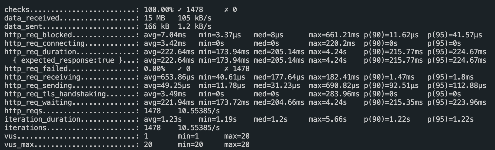
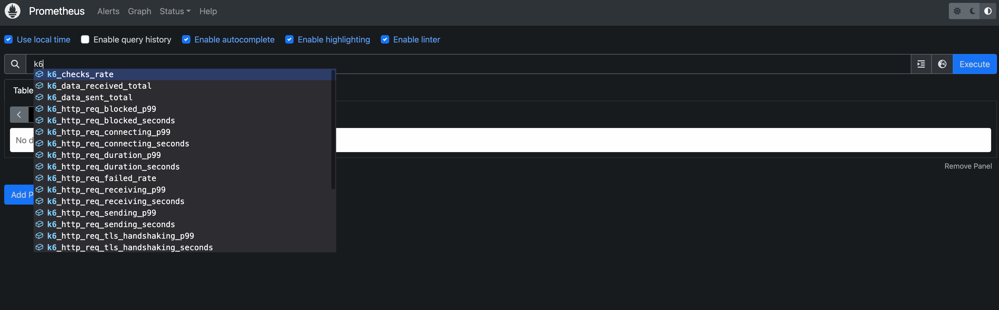
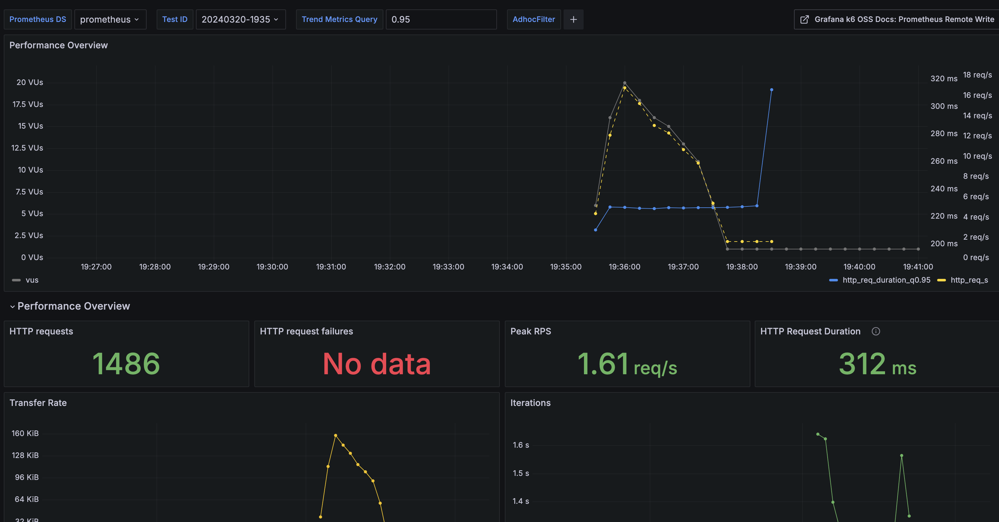

# K6 Results output

## metric 분석 방법 2가지

1. End-of-test summary report 
2. 테스트 중 timestamp 마다 측정된 measurements

result output은 커스터마이징도 가능하다.
- custom metric 생성 가능
- 새로운 summary statistics 생성해서 텍스트 포맷으로 출력 가능
- influxDB, prometheus 등에 결과를 스트리밍할 수 있음.


## Metrics
[metrics documentation](https://grafana.com/docs/k6/latest/using-k6/metrics/)


## End-of-test summary
[End-of-test summary documentation](https://grafana.com/docs/k6/latest/results-output/end-of-test/)

k6는 디폴트로 stdout으로 테스트 결과를 보여준다.


- median, average values
- minimum, maximum values
- p90, p95, p99 values


## Time series and external outputs
[real time metrics documentation](https://grafana.com/docs/k6/latest/results-output/real-time/)


end-of-test summary 는 top-level 관점에서만 결과를 보여주기 때문에, 자세한 분석을 위해서는 time series 데이터를 봐야 한다.

time series metric 데이터는
1. json/csv 파일로 떨구거나
2. 외부 서비스에 스트리밍할 수 있다.
   1. elasticsearch, prometheus, influxdb, datadog 등..


### json output으로 time series metric 남기기
```shell
k6 run --out json=test.json script.js 
```


### prometheus output으로 time series metric 남기기
`prometheus remote write`이라는 프로토콜로 k6 -> prometheus로 데이터를 전송하는데,   
sender 가 receiver한테 실시간으로 데이터를 전송할 수 있게 해주는 프로토콜이다.

`k6 run -o experimental-prometheus-rw`으로 k6를 실행하면 프로메테우스의 `prometheus remote write`프로토콜을 통해 
테스트 결과 metric을 프로메테우스의 remote-write endpoint로 전송하고 저장할 수 있다.   
k6 metric의 모든 time-series data points를 전송하고, prometheus time series로 생성해준다.


1. promethues, grafana 실행
   1. prometheus 폴더 하위에 docker-compose.yml 실행
   2. [prometheus](localhost:19090), [grafana](localhost:13030) 접속
   3. grafana에서 k6용 대시보드 import (prometheus/grafana-k6-dashboard-18030.json 파일 import하기)
2. k6로 테스트 스크립트 실행
    - 아래 스크립트의 testid는 임의로 변경 가능. 지금은 20240320-195539 형식으로 자동 생성.
    ```shell
    docker run --rm --network prometheus_k6 -e K6_PROMETHEUS_RW_SERVER_URL=http://prometheus:9090/api/v1/write -e K6_PROMETHEUS_RW_TREND_AS_NATIVE_HISTOGRAM=true -i grafana/k6 run -o experimental-prometheus-rw --tag testid=$(date "+%Y%m%d-%H%M%S")  - <k6-scripts/script.js
    ```
3. prometheus 접속해서 metric이 잘 잡히는지 확인
   Graph 메뉴 접속 후 쿼리에 k6 입력했을 때 metric 이 뜨는지 확인

    

4. grafana 접속해서 대시보드에 잡히는지 확인

    
   

### elasticsearch output으로 time series metric 남기기
[xk6-output-elasticsearch github](https://github.com/elastic/xk6-output-elasticsearch)

> 이 플러그인은 ES 8버전만 지원. 7버전 지원을 위한 깃헙 이슈 생성해놨음.

1. ES 실행
2. xk6-output-elasticsearch가 설치된 k6 이미지 빌드
   1. 위 깃헙 클론하여 그 내부에서 빌드 필수
   2. `git clone git@github.com:elastic/xk6-output-elasticsearch.git`
   3. `cd xk6-output-elasticsearch`
   4. `docker build -t xk6-output-elasticsearch -f ./Dockerfile .`
3. k6 컨테이너 실행
   ```
   docker run --rm --network docker-data_k6 -e K6_ELASTICSEARCH_URL=http://opensearch:9200 -i xk6-output-elasticsearch run -o output-elasticsearch --tag testid=$(date "+%Y%m%d-%H%M%S")  - <k6-scripts/script.js
   ```
4. 지금 AIBOT3.0에서 사용하는 ES(또는 OS)와 연결이 안되어 테스트 스크립트 실행 불가능함.