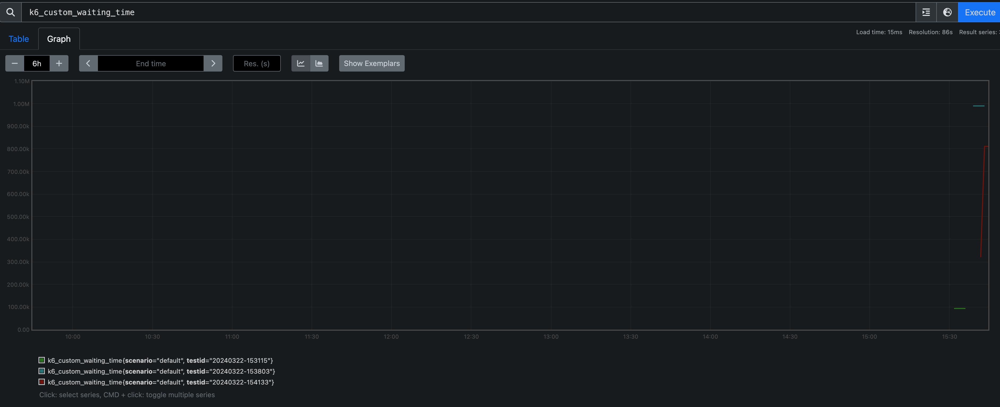

# Metrics


## 종류

1. Counters: sum values
2. Gauges: smallest, largest, latest values 추적
3. Rates: non-zero value 가 얼마나 자주 생기는지
4. Trends: multiple values에 대한 통계량 제공 (mean, mode, percentile 등)


## What can we do

- metric criteria를 가지고 thresholds를 설정하여, 테스트의 실패 여부를 설정할 수 있다.
- metric을 필터링하기 위해서 tags와 groups를 사용할 수 있다.
- metrics 데이터를 test summary report나 granular format으로 export할 수 있다.

## What metrics to look at?

각각의 metric은 성능에 대한 다른 관점을 제공하기 때문에, 적절한 metric을 선택하는 것이 중요하다.

잘 모르겠다면, 아래 세 개부터 보자.

- http_reqs: to measure requests -> traffic
- http_req_failed: to measure error rate -> availability
- http_req_duration: to measure duration -> latency


```sh
     data_received..............: 73 kB   1.1 kB/s
     data_sent..................: 8.5 kB  126 B/s
     http_req_blocked...........: avg=2.1ms    min=2.57µs   med=3.85µs   max=209.96ms p(90)=5.93µs   p(95)=6.23µs  
     http_req_connecting........: avg=2.06ms   min=0s       med=0s       max=206.59ms p(90)=0s       p(95)=0s      
     http_req_duration..........: avg=671.02ms min=206.23ms med=332.04ms max=5.42s    p(90)=369.1ms  p(95)=5.36s   
     http_req_failed............: 100.00% ✓ 100      ✗ 0  
     http_req_receiving.........: avg=147.03µs min=67.72µs  med=133.21µs max=472.95µs p(90)=208.25µs p(95)=225.84µs
     http_req_sending...........: avg=24.85µs  min=11.76µs  med=18.66µs  max=190.96µs p(90)=42.27µs  p(95)=62.6µs  
     http_req_tls_handshaking...: avg=0s       min=0s       med=0s       max=0s       p(90)=0s       p(95)=0s      
     http_req_waiting...........: avg=670.85ms min=205.85ms med=331.86ms max=5.42s    p(90)=368.96ms p(95)=5.36s   
     http_reqs..................: 100     1.485199/s
     iteration_duration.........: avg=1m7s     min=1m7s     med=1m7s     max=1m7s     p(90)=1m7s     p(95)=1m7s    
     iterations.................: 1       0.014852/s
     vus........................: 1       min=1      max=1
     vus_max....................: 1       min=1      max=1
```

## Built-in metrics

`http`, `iteration`, `vu` 로 시작하는 metric은 빌트인 metric이다.

### 1. Standard built-in metrics

<table>
<thead>
<th>Metric name</th>
<th>Type</th>
<th>Description</th>
</thead>

<tbody>

<tr>
<td>checks</td>
<td>Rate</td>
<td>성공적인 check의 비율</td>
</tr>

<tr>
<td>data_received</td>
<td>Counter</td>
<td>받은 데이터의 amount</td>
</tr>

<tr>
<td>data_sent</td>
<td>Counter</td>
<td>보낸 데이터의 amount</td>
</tr>

<tr>
<td>dropped_iterations</td>
<td>Counter</td>
<td>VU 부족/duration 부족으로 인해 시작되지 못한 iteration 개수. 시나리오가 모든 iteration이 끝나기 전 maxDuration에 도달하게 되거나, 남는 VU가 없거나, SUT의 성능이 degrade되어 iteration이 끝나는 데에 너무 오래 걸리는 경우 발생 가능. </td>
</tr>

<tr>
<td>iteration_duration</td>
<td>Trend</td>
<td>하나의 full iteration을 끝내는 데에 걸린 시간. setup과 teardown 시간을 포함. http-request-iteration-duartions.js 파일에서 setup, teardown, 디폴트 시나리오의 iteration_duration 시간을 나눠서 threshold 설정하는 예시가 있다.</td>
</tr>

<tr>
<td>iterations</td>
<td>Counter</td>
<td>VU가 default 함수를 수행한 총 횟수</td>
</tr>

<tr>
<td>vus</td>
<td>Gauge</td>
<td>현재 동작하고 있는 실제 VU 수</td>
</tr>

<tr>
<td>vus_max</td>
<td>Gauge</td>
<td>최대 VU 수</td>
</tr>

</tbody>
</table>

### 2. HTTP-Specific built-in metrics

<table>
<thead>
<th>Metric name</th>
<th>Type</th>
<th>Description</th>
</thead>

<tbody>
<tr>
<td>http_req_blocked</td>
<td>Trend</td>
<td>요청을 초기화(initiating)하기 전에 free TCP connection slot을 기다리면서 block된 시간.</td>
</tr>

<tr>
<td>http_req_connecting</td>
<td>Trend</td>
<td>Remote host와 TCP connection을 맺을 때 걸린 시간</td>
</tr>

<tr>
<td>http_req_duration</td>
<td>Trend</td>
<td>요청에 걸린 총 시간. http_req_sending + http_req_waiting + http_req_receiving이다. Remote 서버가 초기 DNS lookup/connection time을 제외하고 요청을 처리하고 응답하는데 걸린 시간.</td>
</tr>

<tr>
<td>http_req_failed</td>
<td>Rate</td>
<td>실패한 요청의 비율. status code가 200~399인 경우 성공으로 본다. 그 외는 실패 처리.</td>
</tr>

<tr>
<td>http_req_receiving</td>
<td>Trend</td>
<td>Remote host에서 데이터를 받을 때 걸린 시간.</td>
</tr>

<tr>
<td>http_req_sending</td>
<td>Trend</td>
<td>Remote host에 데이터를 보낼 때 걸린 시간.</td>
</tr>

<tr>
<td>http_req_tls_handshaking</td>
<td>Trend</td>
<td>Remote host와 TLS 세션 handshaking할 때 걸린 시간</td>
</tr>

<tr>
<td>http_req_waiting</td>
<td>Trend</td>
<td>Remote host에서 </td>
</tr>

<tr>
<td>http_reqs</td>
<td>Counter</td>
<td>k6가 만든 총 HTTP request 개수</td>
</tr>

</tbody>
</table>


### 3. Built-in WebSocket metrics


<table>
<thead>
<th>Metric name</th>
<th>Type</th>
<th>Description</th>
</thead>

<tbody>

<tr>
<td>ws_connecting</td>
<td>Trend</td>
<td>웹소켓 connection request에 걸린 총 시간</td>
</tr>

<tr>
<td>ws_msgs_received</td>
<td>Counter</td>
<td>받은 메시지의 총 개수 (total number)</td>
</tr>

<tr>
<td>ws_msgs_sent</td>
<td>Counter</td>
<td>보낸 메시지의 총 개수 (total number)</td>
</tr>

<tr>
<td>ws_ping</td>
<td>Trend</td>
<td>Ping 요청과 pong 응답에 걸린 시간</td>
</tr>

<tr>
<td>ws_session_duration</td>
<td>Trend</td>
<td>웹소켓 세션의 duration. 커넥션 시작부터 VU 실행 종료 사이의 시간.</td>
</tr>

<tr>
<td>ws_sessions</td>
<td>Counter</td>
<td>웹소켓 세션의 총 개수</td>
</tr>

</tbody>
</table>


### 그 외

Browser, gRPC metrics는 [공식 문서](https://grafana.com/docs/k6/latest/using-k6/metrics/reference/) 참조하자.


<br/>


## Custom metrics

metric 타입마다 커스텀 메트릭을 정의하여 사용할 수 있다. 메트릭 타입마다 constructor가 있는데, [문서](https://grafana.com/docs/k6/latest/javascript-api/k6-metrics/) 참고하면 된다.    
`add` 메소드를 사용해서 데이터를 넣으면 된다.


```js
import http from 'k6/http';
import { Trend } from 'k6/metrics';

export const options = {
  vus: 10,
  duration: '10s'
}

const myTrend = new Trend('custom_waiting_time'); // Trend 타입의 custom metric
 
export default function () {
  const r = http.get('https://httpbin.test.k6.io');
  myTrend.add(r.timings.waiting);
}
```

prometheus에서도 조회 가능하다.


